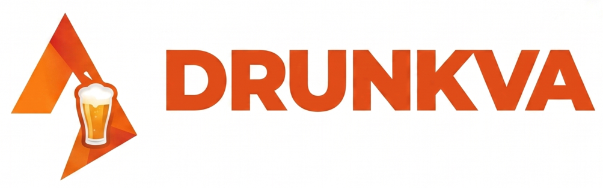
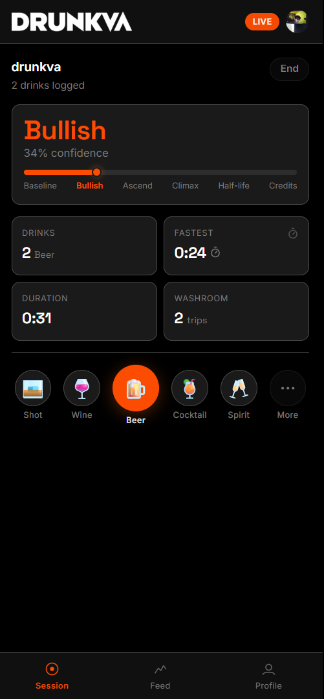
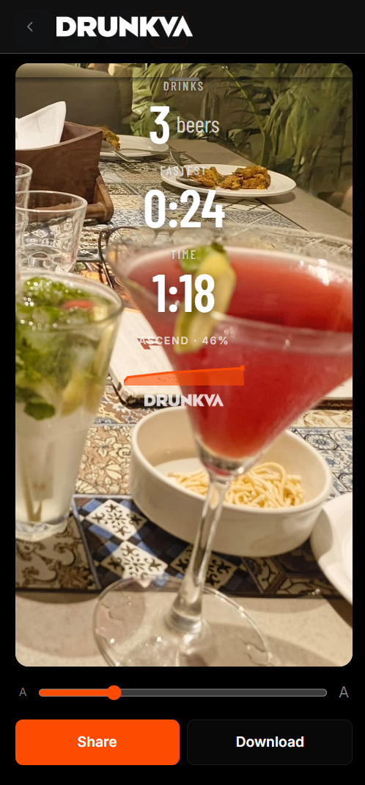

<p align="center">
  
</p>

<p align="center">
  <strong>Track your night. Share the story.</strong><br/>
  A social drinking session tracker — Strava for nights out.
</p>

<p align="center">
  
  
  
  
  
  
</p>

## What is Drunkva?

Drunkva is a mobile-first, social session tracker for your nights out. You log drinks in real-time to build a live "confidence curve" that categorizes your night into six distinct stages: Baseline, Bullish, Ascend, Climax, Half-life, and Credits. When the night ends, you export a personalized, AI-captioned photo overlay (the "Morning Card") to share your peak stats with friends. On the platform, a real-time social feed lets you verify sessions with tagged witnesses, view confidence arcs, and "cheers" your friends' nights.

## Screenshots

> Screenshots taken at 390px mobile viewport — the target form factor.

<p align="center">
  
  &nbsp;&nbsp;&nbsp;
  
  &nbsp;&nbsp;&nbsp;
  
</p>
<p align="center">
  <em>Live Session &nbsp;&nbsp;&nbsp; Share Card &nbsp;&nbsp;&nbsp; Social Feed</em>
</p>

## Features

**Session Tracking**
* 🍺 Every drink type carries a specific confidence weight (e.g., Beer: 12, Shot: 18)
* 📈 Live confidence curve tracking exact stages: Baseline, Bullish, Ascend, Climax, Half-life, Credits
* ⏱️ Fastest drink timer with PR (Personal Record) detection
* 🚽 Washroom trips, burp counter, and chakna (snack) level tracking

**Share Card**
* 🖼️ Two overlay templates: Template C (Full story) and Template A (Minimal)
* 🤖 LLM-generated session title via Groq (e.g., "I'm 3 wines in on the rooftop")
* 📸 `html2canvas` export at 3x density for crisp social sharing
* 🔗 Web Share API integration with download fallback
* 📱 Formats supported: 1080x1920 (Story) and 1080x1080 (Square)

**Social**
* 🔄 Infinite scrolling social feed with 30-second background polling for "cheers" counts
* 🤝 Mutual follow system
* 📊 Session detail view with an interactive Recharts confidence arc
* 👁️ Social verification: tag up to 5 witnesses after your session
* ✅ Verified badge on confirmed sessions (requires 2+ witness confirms)

**PWA**
* 📲 Installable as a Progressive Web App
* 📴 Offline drink logging via IndexedDB queue (`drunkva-offline`)
* 🔄 Automatic background sync on network reconnect with real-time UI indicators
* 🔔 Push notifications for morning cards and witness tagging
* 💡 Custom native-feeling install prompt on second visit

**Tech Highlights**
* Implemented strict hydration mismatch fixes for native dark-mode (`color-scheme: dark`)
* Uses Vercel Cron (`/api/cron/morning-card`) for automated 10 AM notifications
* Real-time visibility-state based polling to conserve battery while keeping social feeds alive
* Client-side offline synchronization queue using `idb`

## Tech Stack

| Layer | Technology | Purpose |
|---|---|---|
| **Framework** | Next.js 16.0.10 (App Router) | Core React framework and API routes |
| **UI / Styling** | React 19, Tailwind CSS 4 | Modern functional components and utility-first styling |
| **Components** | shadcn/ui | Accessible, customizable UI primitives |
| **Database** | Neon Postgres (Serverless) | Fast, edge-ready relational database |
| **Authentication** | Clerk | Secure user onboarding and identity management |
| **AI Generation** | Groq (`llama-3.3-70b-versatile`) | Fast, context-aware session title generation |
| **Offline Storage** | IndexedDB (`idb`) | Robust queue for offline drink logging |
| **Notifications** | web-push | VAPID-based push notifications for PWA |
| **Export** | `html2canvas` | Client-side rendering of DOM nodes to PNG blobs |

## Confidence Curve

Drunkva tracks your night using a proprietary confidence curve algorithm that weights different types of alcohol against time.

| Drink Type | Weight |
|---|---|
| 🍷 Wine | +10 |
| 🍺 Beer | +12 |
| 🍹 Cocktail | +13 |
| 🥂 Spirit | +15 |
| 🥃 Shot | +18 |

**Stages**
* **Baseline**: 10% - 15%
* **Bullish**: 16% - 35%
* **Ascend**: 36% - 58%
* **Climax**: 59% - 82%
* **Half-life**: 83% - 92%
* **Credits**: 93% - 99%

**How it works**
The confidence floor is hard-capped at **10%** and peaks at **99%** (because no one is ever truly 100% in control). 
Time decay kicks in if you stop drinking: after a 90-minute grace period, your confidence decays by **5% every 30 minutes**.

The card always shows your peak — not where you ended up.

## Project Structure

```text
drunkva/
├── app/
│   ├── api/              # Next.js route handlers
│   │   ├── sessions/     # Session CRUD
│   │   ├── drinks/       # Drink logging + confidence recalc
│   │   ├── title/        # Groq title generation
│   │   └── ...           # push, cron, feed, witnesses, follow
│   ├── session/          # Live session screen
│   ├── feed/             # Social feed
│   ├── morning-card/     # Share flow + overlay export
│   ├── profile/          # User profile
│   └── layout.tsx        # Root layout, fonts, providers
├── components/
│   ├── drunkva/          # All Drunkva-specific components
│   └── ui/               # shadcn/ui primitives
├── hooks/                # Custom React hooks (e.g., useOfflineQueue)
├── lib/                  # Utilities, DB client, confidence math, mock auth
├── public/               # Static assets, SW, manifest
└── docs/                 # Screenshots and documentation
```

## Roadmap

**v1 — Current**
* Live session tracking with drink logging and dynamic confidence arc
* Offline PWA support with background synchronization queue
* Shareable morning cards with AI-generated titles and PR badges
* Social feed with 30s polling, cheers, and mutual follows
* Witness tagging and session verification with push notifications

**v2 — Planned**
* Group session mode (one person logs for the table)
* Mic-based burp detection
* Venue leaderboards
* City-wide leaderboards

**v3 — Ideas**
* Year-end Wrapped
* Venue partnerships and branded overlay themes
* Native app wrapper via Capacitor

## Contributing
Pull requests are welcome. Please run `pnpm lint` and `pnpm build` to ensure all checks pass before submitting.

## License
Copyright © 2026 Drunkva. All Rights Reserved. 

This software is proprietary. No part of this codebase may be copied, modified, distributed, sold, or sublicensed without express written permission.
